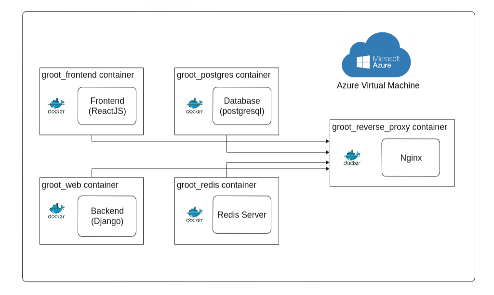
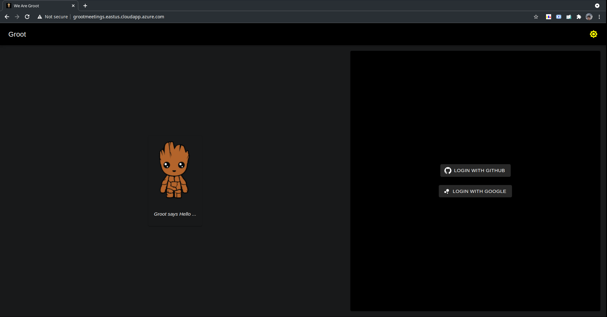
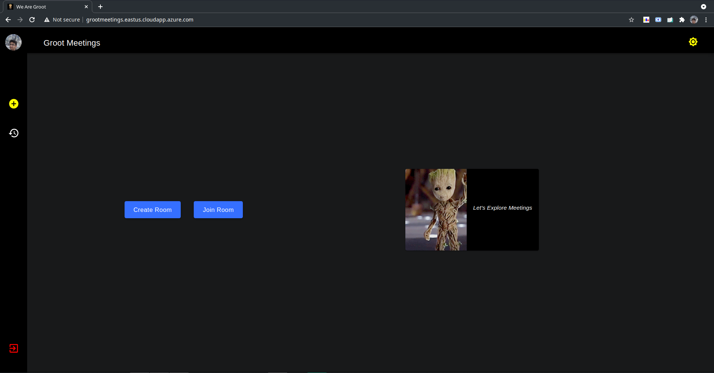
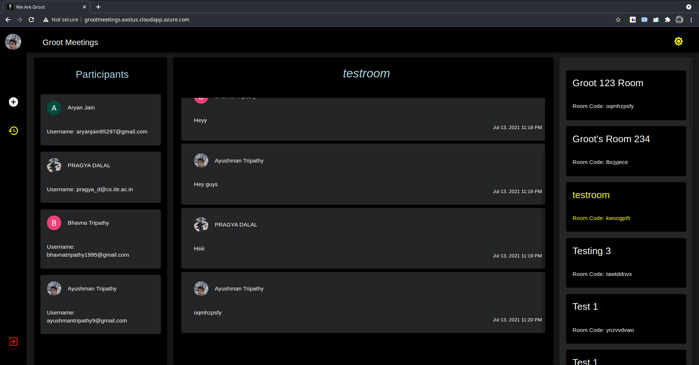
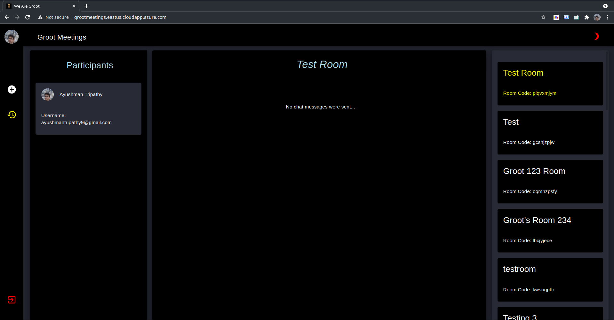
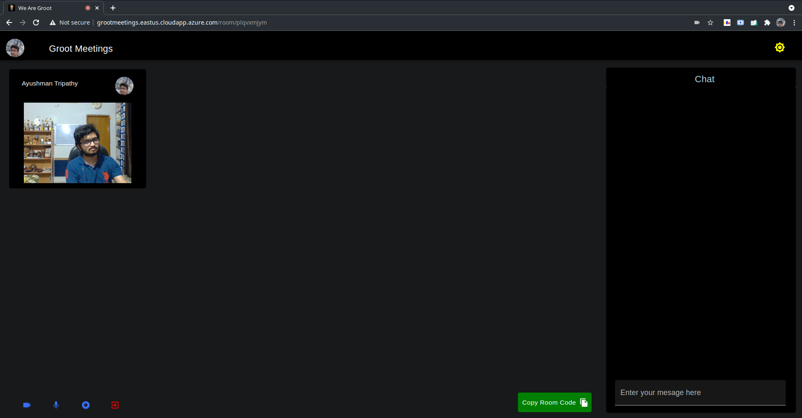
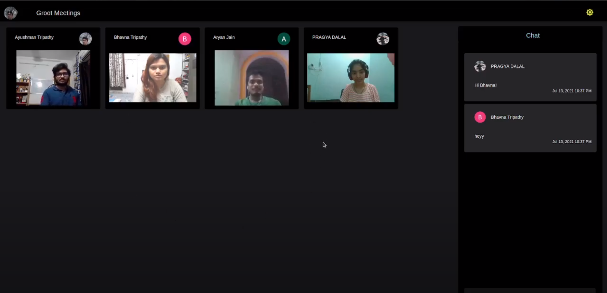

# Groot

Project for Microsoft Engage Programme

This repository contains the code for both frontend and backend for **Groot** app.

The development of this app has been done in accordance with the principles of *Agile Development* in an iterative and incremental manner with adding feature by feature to the app.

***

## Features of Groot
- **Authentication**
    - Uses OAuth2.0 for authentication
    - Both Google and GitHub OAuth present for authentication

- **Rooms**
    - Users can either create or join rooms
    - On creating a new room users can share the url or the room code for other people to join
    - Rooms and the chat messages of the room get preserved even after all the people leave a room
    
    - Joining a Room
        - Users can join room via the room-code from the app home page
        - If a user is authenticated, he/she can directly join the room using the url

- **Video Call**
    - Users in a room can Video Call each other
    - All the basic video call options are present
        
- **Chat** 
    - Users in a room can Chat with each other
    - If a new user joins a room, all the pre-existing chat messages sent would be visible to the user

- **Screen Recording**
    - Any participant in a room can record the meeting and any window of the screen
    - Enabling share audio in the prompt allows users to get the audio recording along with the screen recording

- **Room History**
    - Shows all the rooms that were joined by a user
    - All the participants that ever attended the room are displayed
    - It also shows all the chat messages sent in the room till the instant of time

- **Theme Change**
    - Groot app comes in a light and a dark mode
    - This can be toggled easily by the click of a button
***

## Groot Architecture

### A High Level Architectural Overview of the App in Production

---

You can see from the high-level architecture that the app is built using various docker containers.

- **Frontend**
    - It is built using ReactJS
    - Redux is used as a global store for ease of access of variables
    - Groot uses MaterialUI to render the various components in it
    - The React development server is directly run in its docker container
    - During production, the frontend container builds the app and stores its contents in the build folder. Nginx serves these files from here.

- **Backend**
    - Django is used to make the backend of groot
    - The servers for the same run in the Backend container
    - The signalling for the WebRTC and Chat is handled by WebSockets using Django Channels

- **Database**
    - PostgreSQL is used for the database of the app
    - This is mapped to a volume, so that the data isn't lost when the server is shut down
    - It runs in the postgres container of the app

- **Redis**
    - It acts as the message broker for WS messages
    - The server runs in the redis container of the app

- **Reverse Proxy**
    - Nginx is present in the reverse_proxy container
    - It is present only during production, to serve the static and media files and the frontend of Groot
    - The SSL certificates and config files for Nginx are mounted in this container

***
***The whole code base has been properly documented describing any complex function in it.***

## Groot Snippets

#### Authentication (Landing Page)

---
#### Home 

---

#### Room History 

---

#### Room History in Light Theme (Dracula Theme)

---

#### Video Call Page

---

#### Snippet of Video Call

***

## Deployment
The app has been deployed to an Azure VM.
You can check out the deployment [here](https://grootmeetings.eastus.cloudapp.azure.com/).

***
Developed by [Ayushman Tripathy](https://github.com/ayushmantripathy9) for Microsoft Engage 2021.

Mentors:
- Kushal Agarwal
- Pragya Rustagi
            